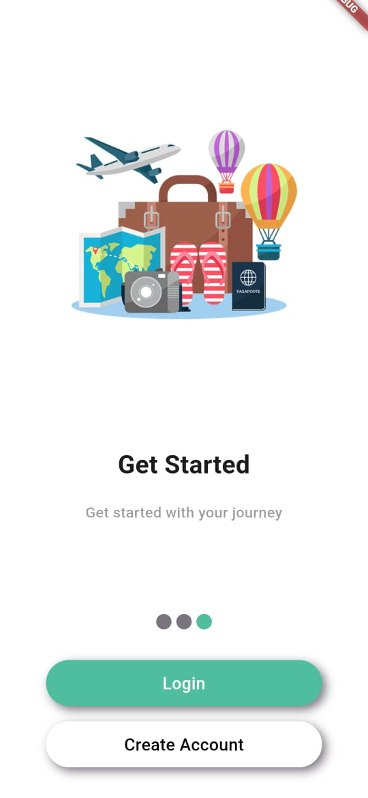

# **Travel Management System** 🚀  

A **Flutter-powered** mobile application designed to simplify and consolidate the booking process for various travel and entertainment services.  

## **📌 Project Overview**  
The **Travel Management System** is an Android mobile application that integrates multiple booking functionalities into a single, user-friendly platform. Whether it's renting a car, purchasing bus and cinema tickets, or planning tours, users can do it all from one app—eliminating the hassle of using multiple websites and services. 

# My Flutter App

## Screenshots

### 1. Splash Screen

### 2. Introduction

### 3. SignUp Page

### 4. Login Page

### 5. Home Screen

### 6. Car Rental Screen

### **🌟 Features**  
✅ **Airline Tickets** – Book flights effortlessly.  
✅ **Car Rentals** – Rent vehicles tailored to your travel needs.  
✅ **Bus Ticket Booking** – Search, compare, and book bus tickets conveniently.  
✅ **Cinema Tickets** – Purchase movie tickets in just a few taps.  
✅ **Tour Planning** – Organize and book guided tours seamlessly.  
✅ **All-in-One Platform** – Your complete travel and entertainment solution in one app.  

## **❗ Problem Statement**  
Many users struggle with juggling multiple platforms to book travel and entertainment services, leading to wasted time and inconvenience. The **Travel Management System** provides a **centralized solution**, offering seamless access to various services in one place—improving efficiency, saving time, and enhancing the overall user experience.  

## **👨‍💻 Team Members**  
- **Ata Ur Rehman** (22L-7841)  
- **Danish Ajmal** (22L-6590)  

## **🚀 Getting Started**  

### **🔧 Prerequisites**  
Before running the project, ensure you have the following installed:  
- **Flutter SDK** → [Install Flutter](https://flutter.dev/docs/get-started/install)  
- **Dart SDK** (comes with Flutter)  
- **IDE** → Recommended: [Android Studio](https://developer.android.com/studio) or [VS Code](https://code.visualstudio.com/) with Flutter & Dart plugins.  

### **⚡ Installation & Setup**  
1. **Clone the repository**  
   git clone https://github.com/your-username/travel-management-system.git
   cd travel-management-system
2. **Install dependencies**  
   flutter pub get
3. **Run the application**  
   flutter run

## **📚 Resources & Documentation**  
If you're new to Flutter, check out these resources:  
🔹 [Flutter Codelabs – Write Your First App](https://docs.flutter.dev/get-started/codelab)  
🔹 [Flutter Cookbook – Useful Samples](https://docs.flutter.dev/cookbook)  
🔹 [Official Flutter Documentation](https://docs.flutter.dev/)  

📌 **Future Enhancements:**  
🚀 **Payment Gateway Integration** (Stripe, Razorpay, etc.)  
🚀 **Multi-Language Support**  
🚀 **Dark Mode**  

Feel free to **contribute, suggest improvements, or report bugs**! 🛠️  

### 📧 **Contact & Support**  
💼 **GitHub:** [Your GitHub Profile](https://github.com/ataur-rehman)  
📩 **Email: ataurrehman3636@gmail.com

### ⭐ If you like this project, consider giving it a **star** on GitHub! ⭐  
